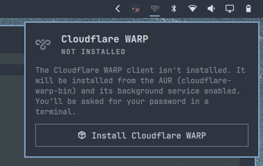
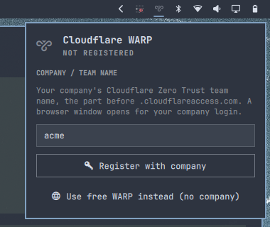
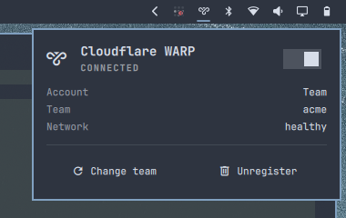
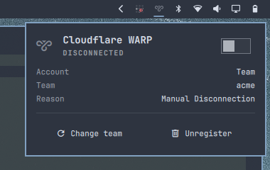

# Cloudflare WARP for Omarchy

An [Omarchy](https://omarchy.org) shell plugin that handles Cloudflare WARP
entirely from the bar — no terminal commands to remember.

Click the 󰖂 icon in the bar to open the panel. It walks you through each step:

1. **Install:** if `warp-cli` is missing, one click installs
   `cloudflare-warp-bin` from the AUR and enables the `warp-svc` service. This
   happens in a floating terminal so you can enter your sudo password.
2. **Register:** enter your company's Cloudflare Zero Trust **team name** (the
   part before `.cloudflareaccess.com`). A browser window opens for your
   company login, and the device is registered when you finish. You can also
   pick **free WARP** if you don't have a company account.
3. **Use:** switch the VPN on and off with the toggle. The panel shows the
   account type, team, network health and any disconnect reason. You can also
   **change team** or **unregister**.

## Screenshots

| 1. Install | 2. Register with your company |
|---|---|
|  |  |
| **3. Connected** | **4. Disconnected** |
|  |  |

| Action | Result |
|---|---|
| Left-click icon | Open / close the panel |
| Middle-click icon | Toggle VPN without opening the panel |
| `Enter` / `Space` / `T` in panel | Toggle VPN |
| `R` in panel | Refresh status |
| `Esc` | Close panel |

The bar icon is dimmed while WARP is disconnected.

## Install

```bash
omarchy plugin add https://github.com/Coding-Sparrow/omarchy-cloudflare-warp.git --enable
```

Or by hand:

```bash
git clone https://github.com/Coding-Sparrow/omarchy-cloudflare-warp.git \
  ~/.config/omarchy/plugins/coding-sparrow.cloudflare-warp
omarchy-shell shell rescanPlugins
omarchy plugin enable coding-sparrow.cloudflare-warp
```

When enabled, the icon is added to the right section of the bar. To put it
somewhere else, drag it to any free spot, or use `omarchy bar move`.

## Remove

```bash
omarchy plugin disable coding-sparrow.cloudflare-warp   # hide from the bar, keep the files
omarchy plugin remove coding-sparrow.cloudflare-warp    # delete the plugin checkout
```

Removing the plugin leaves Cloudflare WARP itself installed. To remove that too:

```bash
warp-cli --accept-tos registration delete
sudo systemctl disable --now warp-svc
omarchy pkg drop cloudflare-warp-bin
```

## Requirements

- Omarchy with the Omarchy shell (Quickshell bar), 4.x
- [`cloudflare-warp-bin`](https://aur.archlinux.org/packages/cloudflare-warp-bin)
  (AUR, proprietary Cloudflare client providing `warp-cli` and `warp-svc`).
  The plugin offers to install it for you through `omarchy-pkg-aur-add`, and
  enabling `warp-svc` asks for your sudo password in a visible terminal.
  Nothing is installed or changed without you clicking **Install**.
- A browser, for Zero Trust team login

The plugin writes no configuration outside its own entry in
`~/.config/omarchy/shell.json`.

## Notes

- The official `warp-taskbar` tray app isn't needed; you can disable it with
  `systemctl --user disable --now warp-taskbar`.
- Zero Trust login uses the `com.cloudflare.warp://` deep-link handler that
  ships with `cloudflare-warp-bin`.
- All the CLI work lives in [`scripts/warp-setup`](scripts/warp-setup), which
  you can also run directly (`warp-setup state`, `warp-setup register acme`, …).

## License

MIT
