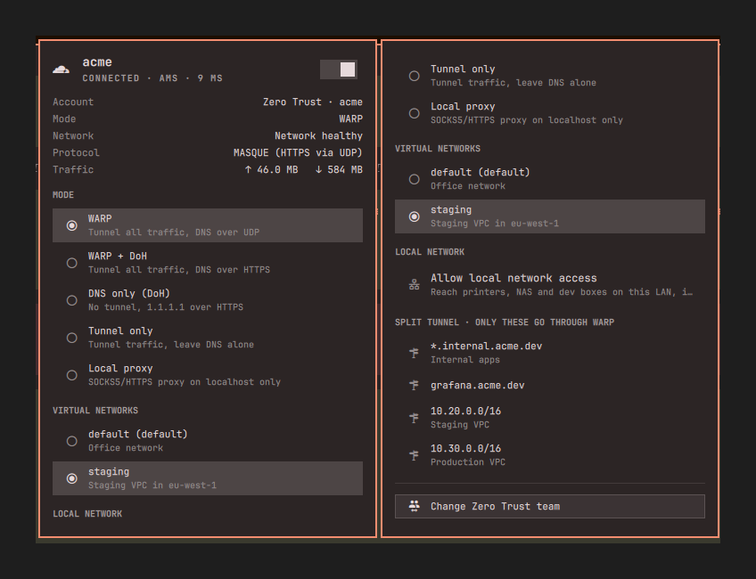
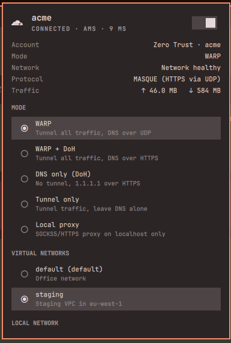
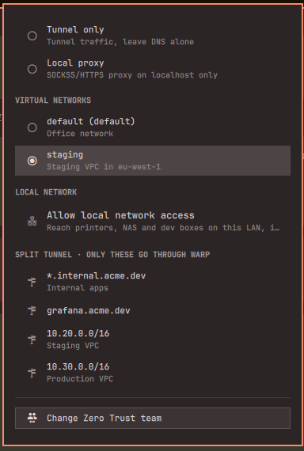
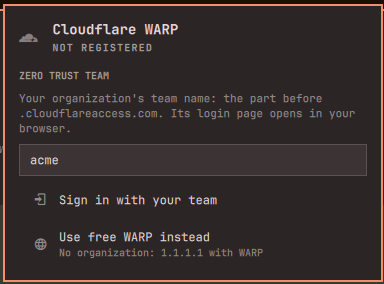
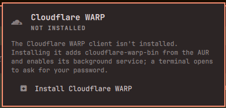

# Cloudflare WARP for Omarchy

An [Omarchy](https://omarchy.org) shell plugin for Cloudflare WARP and Cloudflare Zero Trust. It handles everything from the bar, from installing the client to the developer details you usually need `warp-cli` for.



Click the Cloudflare icon in the bar to open the panel:

1. **Install:** if `warp-cli` is missing, one click installs `cloudflare-warp-bin` from the AUR and enables the `warp-svc` service, in a floating terminal so you can enter your sudo password. It also turns off Cloudflare's `warp-taskbar` tray app, since the panel replaces it.
2. **Sign in:** type your company's Zero Trust **team name** (the part before `.cloudflareaccess.com`) and finish the login in your browser. Or pick **free WARP** if you don't have a company account. It connects as soon as registration completes.
3. **Use:**
   - Switch WARP on and off, and see the Cloudflare edge you're on, latency, tunnel protocol and traffic
   - Switch **mode** (WARP, WARP + DoH, DNS only, tunnel only, local proxy) unless your organization locks it. In proxy mode the panel shows the local SOCKS5 address to copy.
   - Switch Zero Trust **virtual networks** when your team has more than one, for example default and staging
   - **Allow local network access** for a while, to reach printers, NAS and dev boxes on your LAN, if your policy permits it
   - See the **split tunnel** hosts and ranges, so you know whether a host goes through WARP, and copy them
   - **Change team** or **unregister** the device

## Screenshots

| Connected | Virtual networks and split tunnel |
|---|---|
|  |  |
| **Sign in to a Zero Trust team** | **Install** |
|  |  |

## Mouse and keyboard

| Action | Result |
|---|---|
| Left-click icon | Open / close the panel |
| Right-click icon | Toggle WARP without opening the panel |
| Middle-click icon | Refresh |
| `j` / `k` or arrows | Move the cursor |
| `Enter` / `Space` | Activate the selected row (toggle, mode, network, ...) |
| `t` | Toggle WARP |
| `c` | Copy the selected split tunnel route |
| `p` | Copy the proxy address, in proxy mode |
| `r` | Refresh |
| `Esc` | Close, or cancel a team change |

The bar icon is dimmed while WARP is disconnected.

From a terminal or keybinding:

```bash
omarchy-shell coding-sparrow.cloudflare-warp toggleWarp   # also: connect, disconnect, status, refresh, open, close, toggle
```

## Install

```bash
omarchy plugin add https://github.com/Coding-Sparrow/omarchy-cloudflare-warp.git --enable
```

Or by hand:

```bash
git clone https://github.com/Coding-Sparrow/omarchy-cloudflare-warp.git \
  ~/.config/omarchy/plugins/coding-sparrow.cloudflare-warp
omarchy-shell shell rescanPlugins
omarchy plugin enable coding-sparrow.cloudflare-warp
```

When enabled, the icon goes in the right section of the bar. Drag it anywhere, or use `omarchy bar move`.

Updating from 1.x: after `omarchy plugin update coding-sparrow.cloudflare-warp`, run `omarchy restart shell` once so the shell loads the new files.

## Remove

```bash
omarchy plugin disable coding-sparrow.cloudflare-warp   # hide from the bar, keep the files
omarchy plugin remove coding-sparrow.cloudflare-warp    # delete the plugin checkout
```

Removing the plugin leaves Cloudflare WARP itself installed. To remove that too:

```bash
warp-cli --accept-tos registration delete
sudo systemctl disable --now warp-svc
omarchy pkg drop cloudflare-warp-bin
```

## Requirements

- Omarchy 4.x with the Omarchy shell (Quickshell bar)
- [`cloudflare-warp-bin`](https://aur.archlinux.org/packages/cloudflare-warp-bin) (AUR, proprietary Cloudflare client providing `warp-cli` and `warp-svc`). The plugin offers to install it through `omarchy-pkg-aur-add`, and enabling `warp-svc` asks for your sudo password in a visible terminal. Nothing is installed or changed until you click **Install** or **Start the WARP service**.
- `jq` (included with Omarchy), for reading `warp-cli`'s JSON output
- `wl-copy` (included with Omarchy), for the copy actions
- A browser, for the Zero Trust team login

The plugin writes no configuration outside its own entry in `~/.config/omarchy/shell.json`. Mode, virtual network and local network changes go through `warp-cli` and follow your organization's policy.

## How it works

- [`scripts/state.sh`](scripts/state.sh) collects `warp-cli -j` output (status, registration, settings, virtual networks, local network override and tunnel stats) into one JSON document.
- [`Model.js`](Model.js) turns that into the values the panel shows. It's plain JavaScript, tested with node.
- [`Service.qml`](Service.qml) polls the state and runs the actions. [`Widget.qml`](Widget.qml) is the bar icon and panel.
- [`scripts/warp-setup`](scripts/warp-setup) does the interactive install and service start, and works on its own too (`warp-setup state`, `warp-setup register acme`, ...).

Run the tests with `tests/run.sh` (needs `jq` and `node`).

## License

MIT
